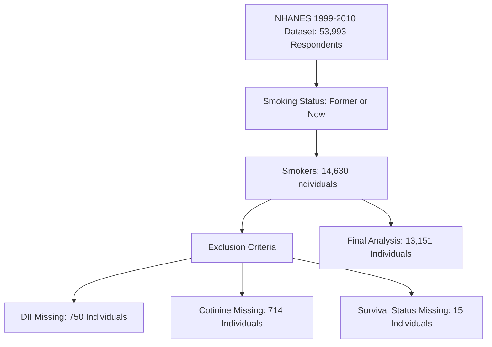

```mermaid
graph TD
    A[NHANES 1999-2010 Dataset: 53,993 Respondents] --> B[Smoking Status: Former or Now]
    B --> C[Smokers: 14,630 Individuals]
    C --> D[Exclusion Criteria]
    D --> E[DII Missing: 750 Individuals]
    D --> F[Cotinine Missing: 714 Individuals]
    D --> G[Survival Status Missing: 15 Individuals]
    C --> H[Final Analysis: 13,151 Individuals]

```